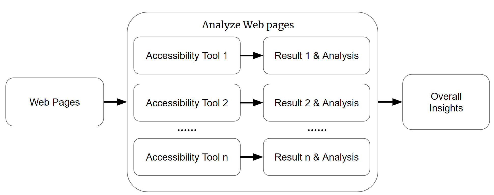

# web-accessibility-issues

The intended use of this repository is for the SWE 295 course being offered at UC Irvine during the Winter 2023 term.

We propose a semi-automated approach for accessibility testing of adaptive Web pages.

## Author

@[KahyeAhn](https://github.com/KahyeAhn)

@[hcn1519](https://github.com/hcn1519)

@[lethal233](https://github.com/lethal233)

## Methodology

We propose a semi-automated approach for accessibility testing of adaptive Web pages. The first step involves collecting
adaptive candidates and inputting them into our system. The system then automatically initiates several accessibility
checking tools to conduct test cases on the pages. The results obtained from each tool will undergo further processing,
including categorization and visualization, to improve interpretation. Subsequently, we manually examine whether there
are any relationships or patterns among the results obtained from different tools. Finally, we summarize the overall
findings obtained from these results.

## Experiments

### Evaluation Subjects

| URL                                          | abbr       |
|----------------------------------------------|------------|
| https://www.ikea.com                         | ikea       |
| https://www.wikipedia.org                    | wiki       |
| https://www.geeksforgeeks.org/               | gfg        |
| https://www.ics.uci.edu/                     | ics        |
| https://www.etsy.com/                        | etsy       |
| https://developer.mozilla.org/en-US/         | mozilla    |
| https://usability.yale.edu/web-accessibility | yale       |
| https://costco.com                           | costco     |
| https://www.traderjoes.com/home              | traderjoes |
| https://samsung.com/                         | samsung    |

### Google Lighthouse

See Google Lighthouse [readme](./googlelighthouse/readme.md).

## Findings/insights

1. The agreement of cookie is error-prone.

## Contact

If you have any question about our projects, feel free to contact us.

## LICENSE

Code is under GPL v3 LICENSE

Other formats of files are under CC-BY-NC-SA v4.0 LICENSE