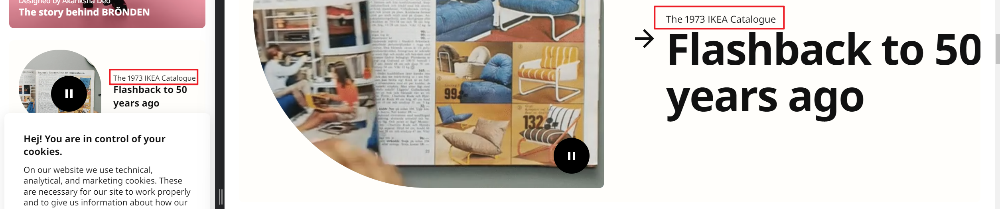
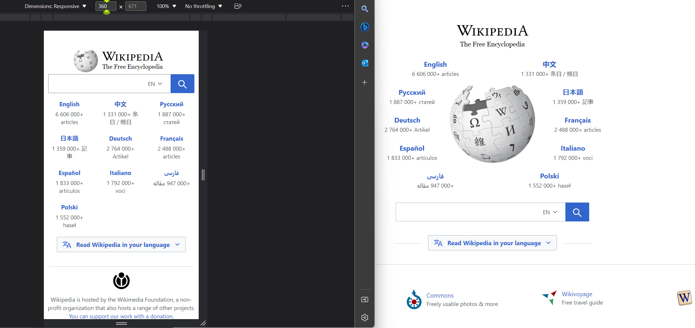
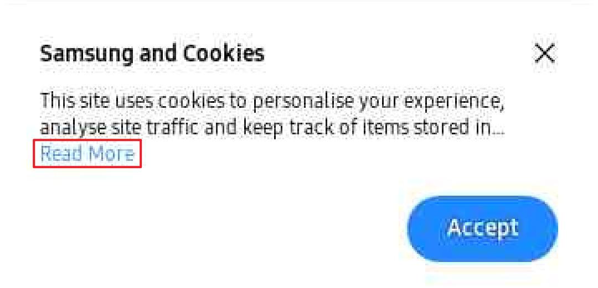
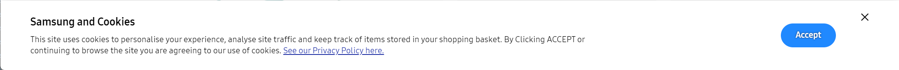
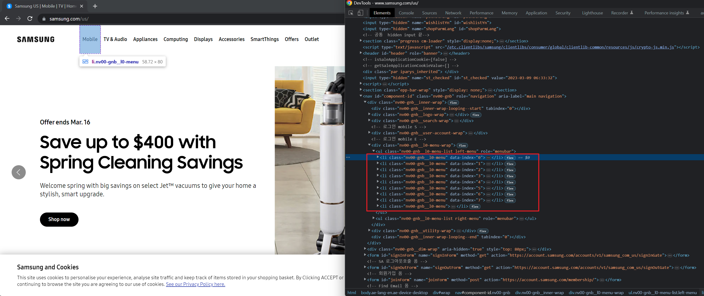
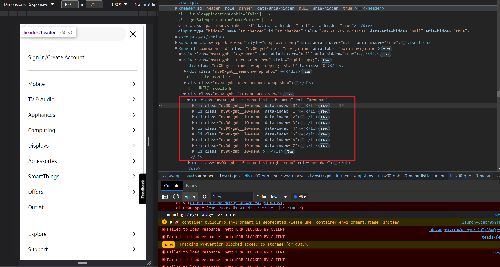
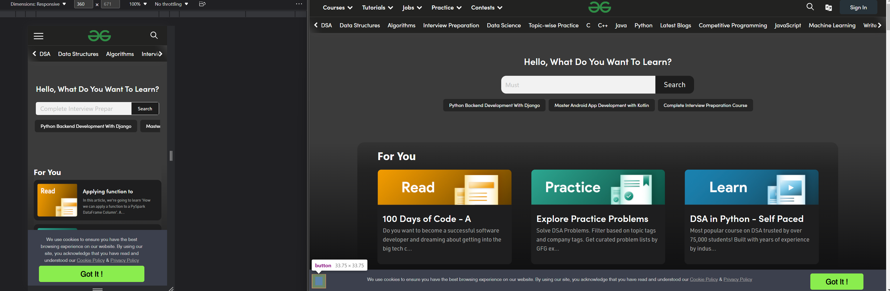
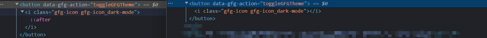
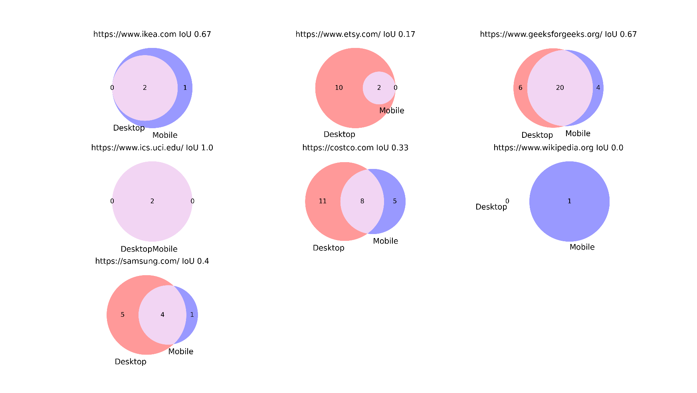

# Generating accessibility report from Google Lighthouse

## Directory hierarchy

```text
url_list.json # url to be evaluated
├───googlelighthouse
│   ├───main.py # main entry of this program
│   ├───venn.py # visualization
│   ├───report-gl.json # overview report
│   ├───csv # processed data in CSV format 
│   ├───fig # figures
│   ├───metadata # raw response from Google lighthouse
│   ├───processed # processed data in JSON format
│   └───screenshot # screenshot of websites obtained by Google Lighthouse
```
## Code
See [main.py](./main.py), [venn.py](venn.py).
## Results

### ikea

**Google Lighthouse may contain bugs**:

This issue is reported only in mobile version, but the renderings are quite the same in desktop and mobile version.
After investigation, we found that Lighthouse did not capture the right code snippet,
see [ikea-mobile](csv/https-www-ikea-com-mob-unique.csv): line 2. You can also check the metadata.
It is `<p>` instead of `<p> The 1973 IKEA Catalogue`. We have attempted several times but got the same results.


## wikipedia
We do not realize what happens to this:

```text
Fix all of the following:
  Form element has explicit <label> that is hidden
```

# samsung

WCAG 1.4.3 specifies the minimum contrast ratio (4.5:1) between text and its background so that it can be read by people
with moderately low vision. Adaptive web pages commonly encounter an issue where different elements are scaled at
varying rates when the browser is resized. In our research, we identified a color contrast problem that was unique to
the mobile version of Samsung. Specifically, the contrast ratio between the text "Read More" and the white background
was only 3.45:1, which did not meet the minimum requirement. This issue was exclusive to the mobile version due to the
limited space available for the element. As the screen width decreases, not all the text can be displayed, and a CSS
style is applied to the element, causing part of the text to be hidden and replaced with "Read More". However, clicking on "Read More" reveals an interface that is identical to the desktop version.

Mobile:



Desktop:



We also do not know why this is a unique issue in desktop version since it exist in mobile version as well (category: structure):
```text
Fix any of the following:
  List item does not have a <ul>, <ol> parent element without a role, or a role="list"
```
Desktop:


Mobile: 


# geekforgeeks

WCAG 4.1.2 requires non-blank values for all user interface components in order to ensure that Assistive Technologies (
AT) can gather information about, activate and keep up to date on the status of user interface controls in the content.
However, there is a unique issue with the desktop version of gfg where text is missing due to the presence of "::after"
in the code snippets. As shown in Fig. x, while the button element can be obtained in the desktop
version, it cannot be accessed in the mobile version and does not contain any information (e.g., inner text). Despite
this, the button is still rendered by the browser and is confusing for screen readers. To address this issue, it is
recommended that gfg removes the CSS from the HTML.




## Visualization


## Category Explanation:

| category                | explanation                                                                    |
|-------------------------|--------------------------------------------------------------------------------|
| keyboard                | operations of tab                                                              |
| aria                    | attribute in the tag, that can be used in accessibility tools: read/visual     |
| structure               | List element has direct children with a role that is not allowed: presentation |
| color                   | color contrast                                                                 |
| name-role-value         | attribute / inner text                                                         |
| parsing                 | same id attribute                                                              |
| forms                   | form related                                                                   |
| language                | html does not have lang attribute                                              |
| text-alternatives       | alt attribute                                                                  |
| sensory-and-visual-cues | maximum-scale on <meta> tag disables zooming on mobile devices                 |
| semantics               | html tag order h1,h2,h3                                                        |