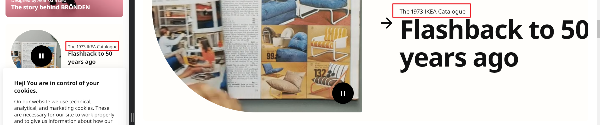
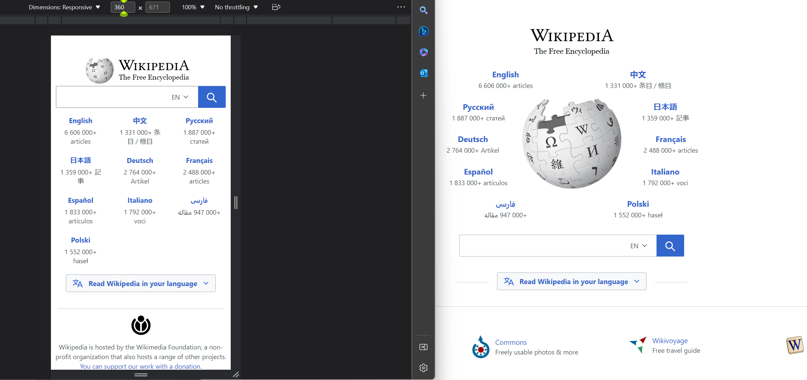
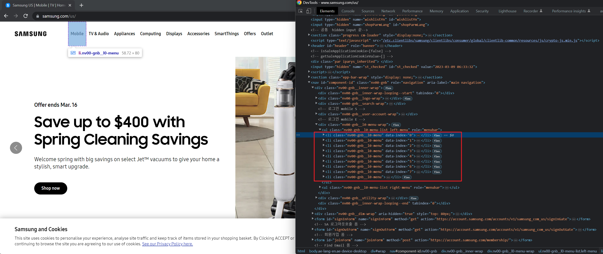
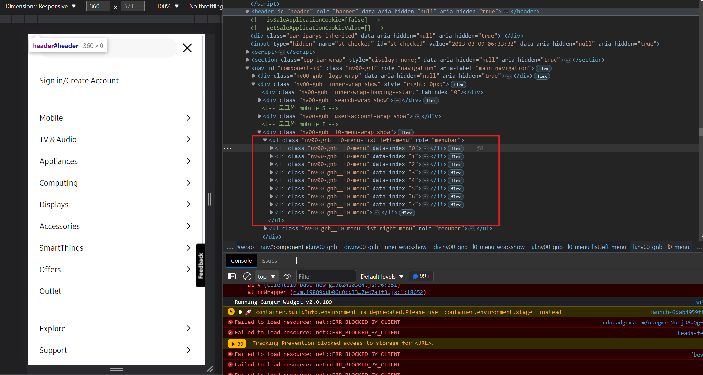
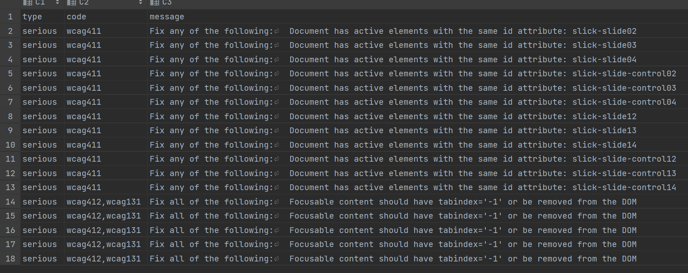
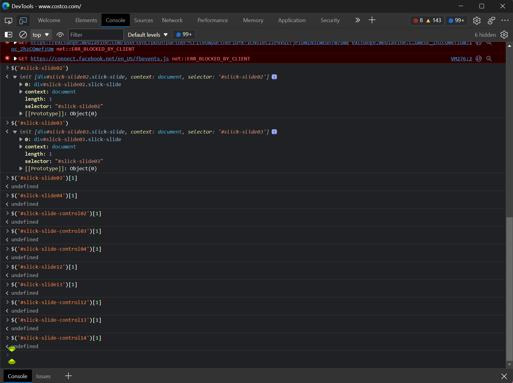
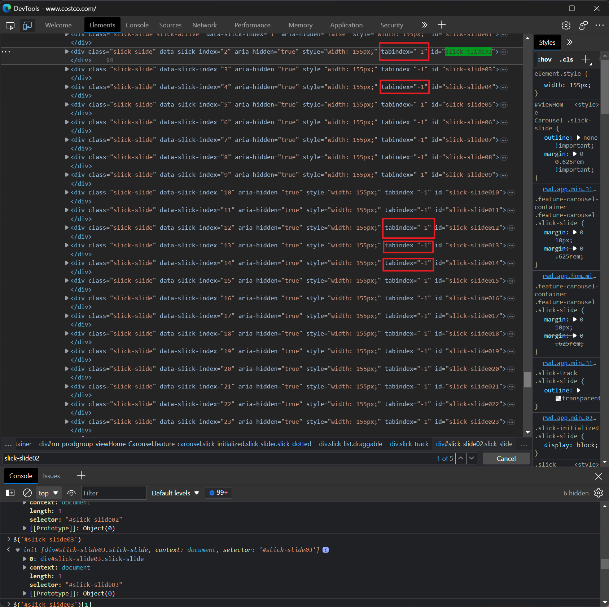
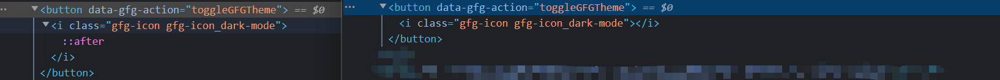

# ikea

For the unique issue in mobile: color

# etsy

mobile, desktop: different rendering 

# ics (now the same)

mobile

desktop: Fix any of the following:
  Element has insufficient color contrast of 1.83 (foreground color: #ffffff, background color: #bfbfbf, font size: 15.0pt (20px), font weight: normal). Expected contrast ratio of 4.5:1

# wikipedia

<label>

# samsung

mobile unique: 
in the desktop: 

desktop unique:  (structure)
Fix any of the following: List item does not have a <ul>, <ol> parent element without a role, or a role="list"
in the mobile: 

!

# costco
unique in mobile: 

# geekforgeeks

# explanation:

| category                | explanation                                                                    |
|-------------------------|--------------------------------------------------------------------------------|
| keyboard                | operations of tab                                                              |
| aria                    | attribute in the tag, that can be used in accessibility tools: read/visual     |
| structure               | List element has direct children with a role that is not allowed: presentation |
| color                   | color contrast                                                                 |
| name-role-value         | attribute / inner text                                                         |
| parsing                 | same id attribute                                                              |
| forms                   | form related                                                                   |
| language                | html does not have lang attribute                                              |
| text-alternatives       | alt attribute                                                                  |
| sensory-and-visual-cues | maximum-scale on <meta> tag disables zooming on mobile devices                 |
| semantics               | html tag order h1,h2,h3                                                        |